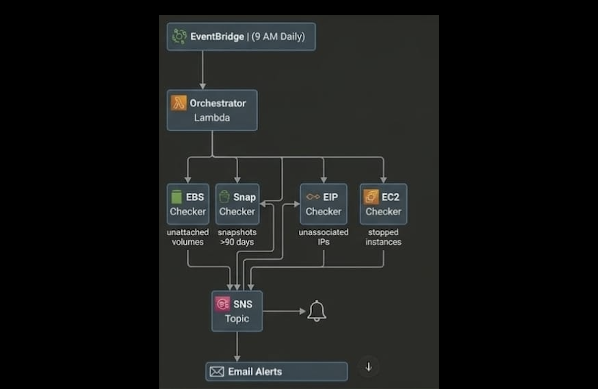

# 💰 Automated AWS Cost Monitoring System

## 📌 Overview

This project is an automated AWS cost optimization system that detects unused and wasteful cloud resources and helps reduce unnecessary expenses.

It continuously monitors AWS resources and generates daily reports, making it useful for real-world cloud cost management.

Designed using a serverless architecture to enable scalable and cost-efficient monitoring.
---

## 🚀 Features

* Detects unattached EBS volumes
* Identifies snapshots older than 90 days
* Finds unassociated Elastic IPs
* Monitors stopped EC2 instances
* Sends daily email reports
* Fully automated using AWS EventBridge scheduler

---

## 🛠 Tech Stack

- AWS Lambda
- Amazon EventBridge
- Amazon SNS
- python
- Boto3

---
</> Markdown

## ⚙️ Deployment Steps

1. Create Lambda function and upload code  
2. Set up IAM role with required permissions  
3. Configure EventBridge rule (daily trigger)  
4. Create SNS topic and subscribe email  
5. Connect Lambda with SNS for notifications  

---

## 📂 Project Structure

* `ebs_checker.py` → Detects unused EBS volumes
* `snapshot_checker.py` → Finds old snapshots
* `eip_checker.py` → Identifies unused Elastic IPs
* `ec2_checker.py` → Lists stopped EC2 instances
* `orchestrator.py` → Runs all checks and generates report

---

## 🖼️ Architecture

---

## 🎯 Purpose

To identify idle AWS resources and reduce cloud costs automatically.

This project simulates real-world cloud cost optimization systems used in production environments.

---
## 💡 Key Highlights

- Serverless architecture using AWS services  
- Fully automated daily monitoring system  
- Event-driven design using EventBridge  
- Real-world cost optimization use case 

## 🚀 Future Improvements

* Multi-region support for monitoring
* Web dashboard for monitoring
* Auto-cleanup of unused resources

---

## 📧 Output

* Logs generated via AWS Lambda execution

---

## 🔥 Author

Developed as a cloud cost optimization project to demonstrate AWS and automation skills.
